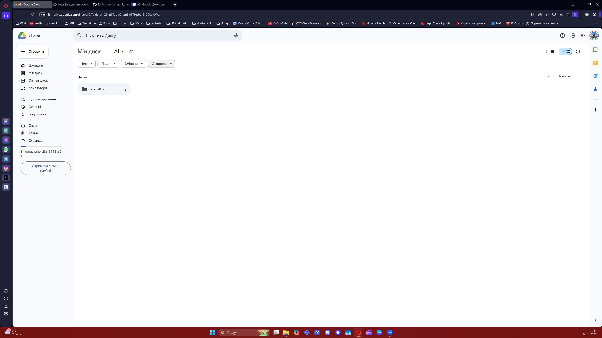
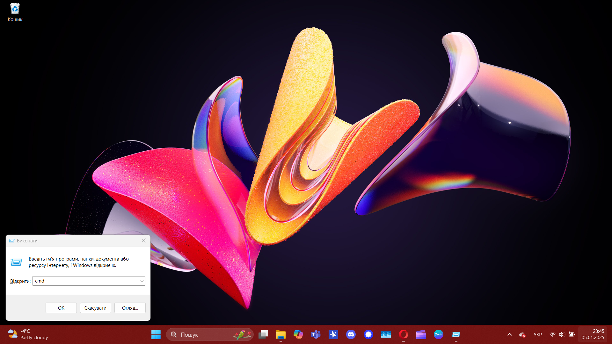
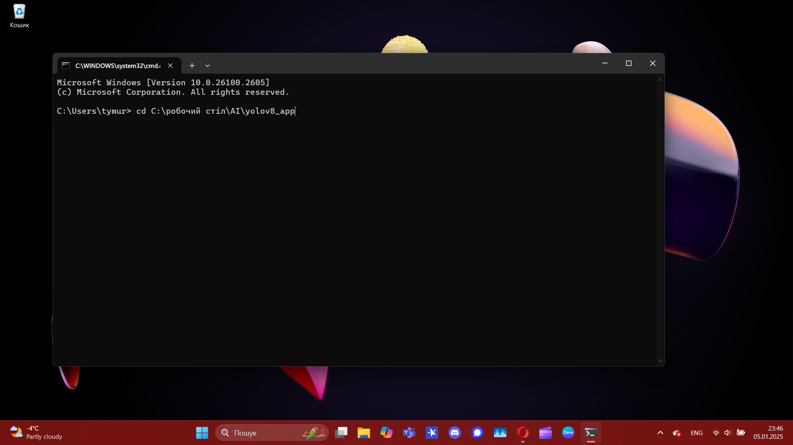
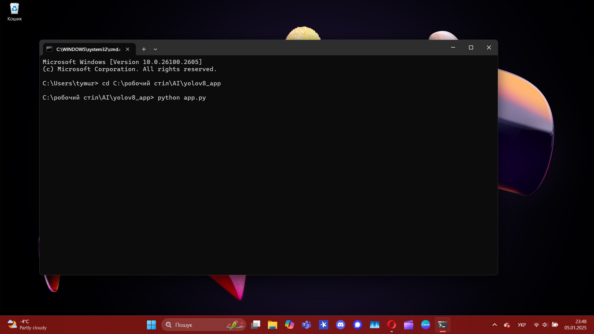
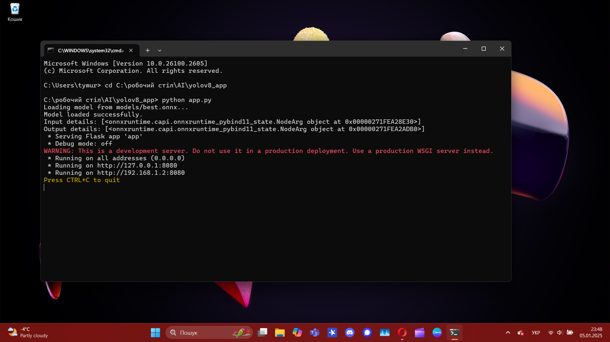
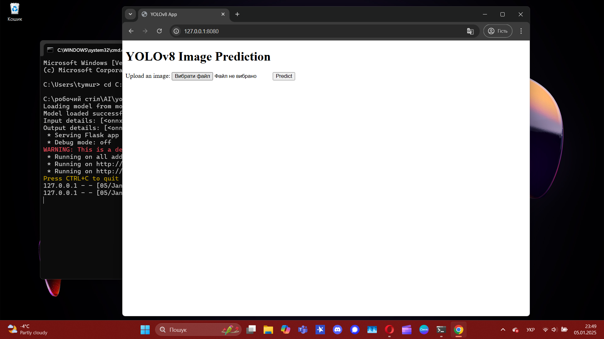
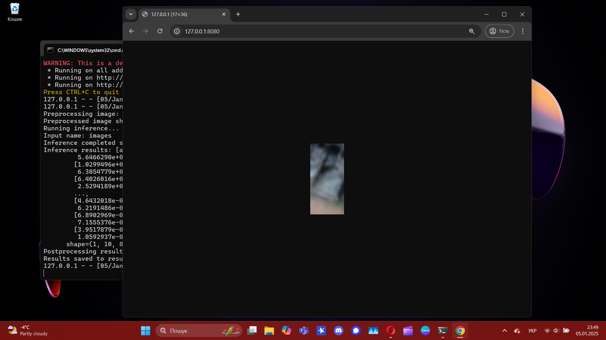

# Instructions for launching

## Steps to use the program

### 1. Відкрийте файл за посиланням
First, you need to open the file on Google Drive: https://drive.google.com/drive/folders/1Q5xnTTqbuQ-amEl0T7Hpbv_S19DWyLWq?usp=sharing

### 1. Upload a files
Download the files to your personal computer

### 3. Opening the console
Go to the console using the key combination `Win + R`. In the window that appears, type `cmd` and press **Enter**.

### 4. Switch to an unpacked folder
In the console, use the command: cd + location of your file 

### 5. Launching the program
Run the command in the console: python app.py

### 6. Getting a link to the site
After launching the program will automatically generate a link to the website. It will appear in the console. Copy this link.

### 7. Opening a website
Paste the copied link into your browser and open it. You will see the website interface.

### 8. Upload an image

You can upload any photo of military equipment on the site's interface. As a result, you will receive a file with the selected equipment.

